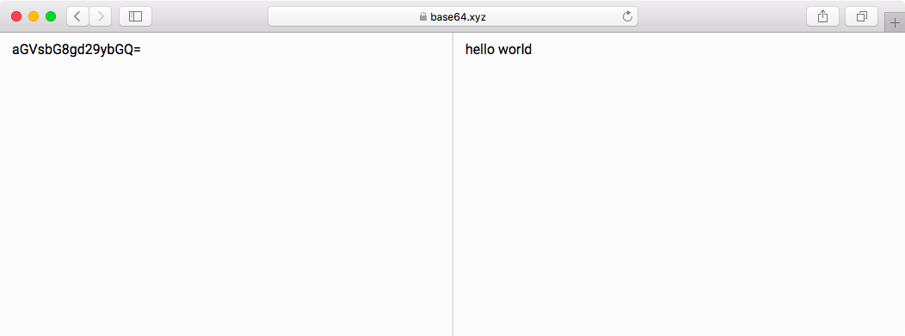

# base64.xyz

A simple base64 decoder/encoder.

## Usage

1. Go to [base64.xyz](https://base64.xyz).
2. Enter base64 encoded text into the left box.
2. Or, enter raw text into the right box.
3. The text will be decoded/encoded.
4. Celebrate.

## Why
Because I decode and encode text often, and I'm a little tired of visiting websites with so many ads.
